# Agent Workflows & Coordination
## Visual Workflow Diagrams and Process Flows

**Version:** 1.0
**Date:** 2025-11-19

---

## 📋 Overview

This document provides visual representations of agent workflows, dependencies, and coordination patterns for the multi-agent Flutter + AI/ML learning platform development.

---

## 🌊 Overall Project Flow

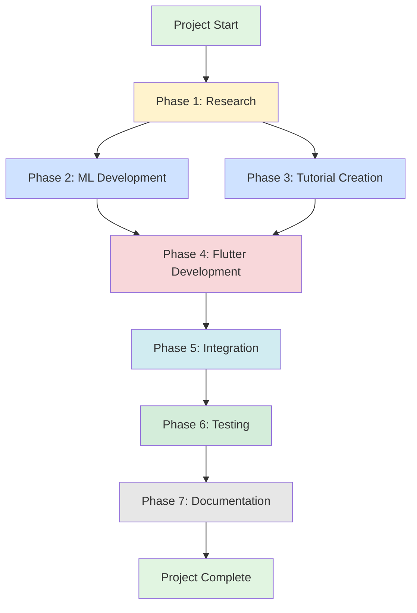

---

## 🤖 Agent Collaboration Map

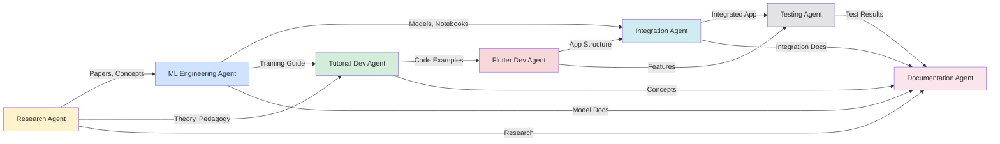

---

## 📊 Workflow 1: Building an ML-Powered Project

### Example: Project 9 - AI Image Classifier

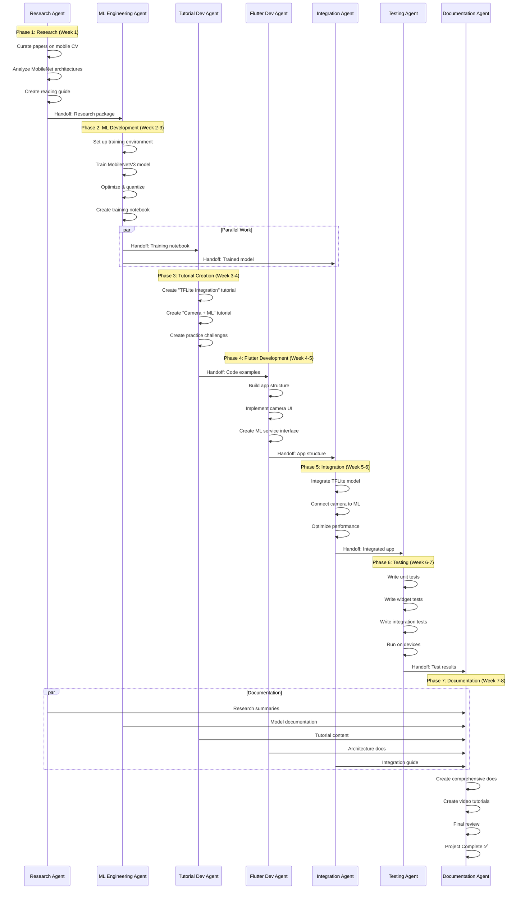

---

## 🔄 Workflow 2: Creating Tutorial Series

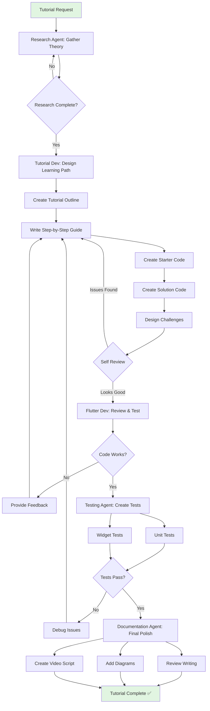

---

## 🚀 Workflow 3: ML Model Development Pipeline

```mermaid
graph LR
    subgraph Research
        R1[Identify Problem]
        R2[Survey Papers]
        R3[Recommend Architecture]
    end

    subgraph ML Development
        M1[Setup Environment]
        M2[Prepare Dataset]
        M3[Train Model]
        M4[Evaluate Performance]
        M5{Meets Targets?}
        M6[Optimize Model]
        M7[Export TFLite]
    end

    subgraph Integration
        I1[Create Flutter Service]
        I2[Add Preprocessing]
        I3[Integrate Model]
        I4[Test Performance]
    end

    subgraph Testing
        T1[Unit Tests]
        T2[Integration Tests]
        T3[Device Tests]
        T4{All Pass?}
    end

    R1 --> R2 --> R3 --> M1
    M1 --> M2 --> M3 --> M4 --> M5
    M5 -->|No| M3
    M5 -->|Yes| M6 --> M7 --> I1
    I1 --> I2 --> I3 --> I4 --> T1
    T1 --> T2 --> T3 --> T4
    T4 -->|No| I3
    T4 -->|Yes| Done[✅ Complete]

    style Done fill:#e1f5e1
```

---

## 📅 Timeline View: 6-Month Implementation

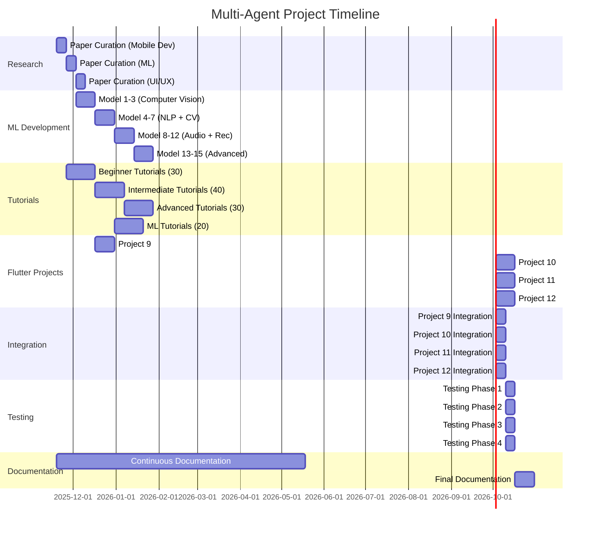

---

## 🔀 Decision Flow: Which Agent to Use?

```mermaid
graph TD
    Start{What type of work?}

    Start -->|Need academic papers| R[Research Agent]
    Start -->|Need ML model| M[ML Engineering Agent]
    Start -->|Need tutorial| T[Tutorial Dev Agent]
    Start -->|Need Flutter app| F[Flutter Dev Agent]
    Start -->|Need integration| I[Integration Agent]
    Start -->|Need tests| TE[Testing Agent]
    Start -->|Need docs| D[Documentation Agent]

    R --> R1{What topic?}
    R1 -->|Mobile Dev| R2[Survey mobile papers]
    R1 -->|ML/AI| R3[Survey ML papers]
    R1 -->|UI/UX| R4[Survey design papers]

    M --> M1{What model type?}
    M1 -->|Vision| M2[CNN-based models]
    M1 -->|Text| M3[NLP models]
    M1 -->|Audio| M4[Audio processing]
    M1 -->|Recommendation| M5[RecSys models]

    T --> T1{What level?}
    T1 -->|Beginner| T2[Basic concepts]
    T1 -->|Intermediate| T3[Advanced features]
    T1 -->|Advanced| T4[Expert techniques]
    T1 -->|ML| T5[ML integration]

    F --> F1{Which project?}
    F1 -->|Project 9| F2[Image Classifier]
    F1 -->|Project 10| F3[Recommendation]
    F1 -->|Project 11| F4[Voice Assistant]
    F1 -->|Project 12| F5[Health Analytics]

    I --> I1{What to integrate?}
    I1 -->|ML Model| I2[TFLite integration]
    I1 -->|API| I3[REST/GraphQL]
    I1 -->|Native| I4[Platform channels]

    TE --> TE1{What tests?}
    TE1 -->|Unit| TE2[Business logic tests]
    TE1 -->|Widget| TE3[UI tests]
    TE1 -->|Integration| TE4[Feature tests]
    TE1 -->|E2E| TE5[User flow tests]

    D --> D1{What docs?}
    D1 -->|API| D2[API reference]
    D1 -->|Architecture| D3[System design]
    D1 -->|Guide| D4[How-to guides]
    D1 -->|Tutorial| D5[Step-by-step]

    style Start fill:#e1f5e1
    style R fill:#fff3cd
    style M fill:#cfe2ff
    style T fill:#d4edda
    style F fill:#f8d7da
    style I fill:#d1ecf1
    style TE fill:#e2e3e5
    style D fill:#fce4ec
```

---

## 🎯 Workflow 4: Quality Assurance Process

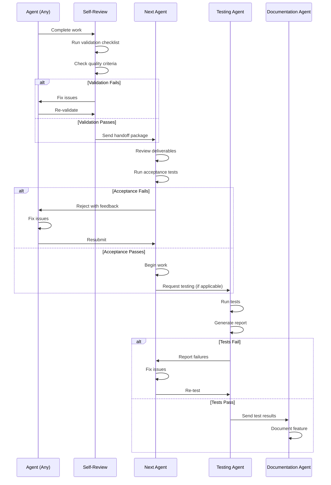

---

## 🔁 Workflow 5: Continuous Integration

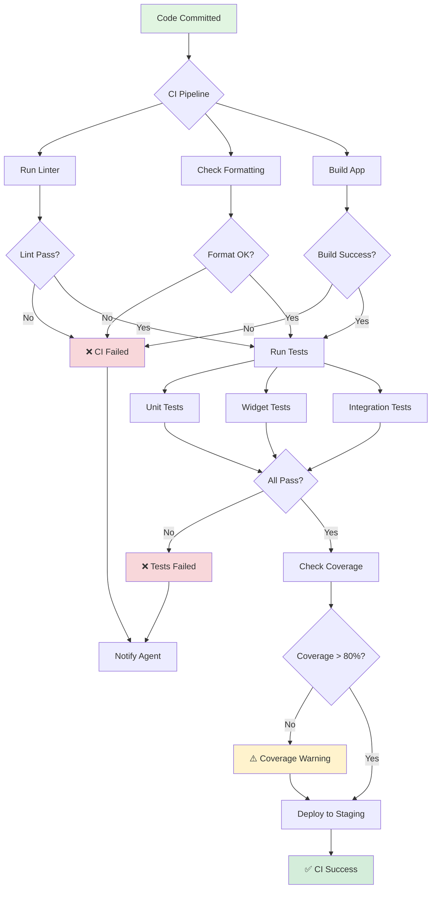

---

## 📦 Workflow 6: Dependency Management

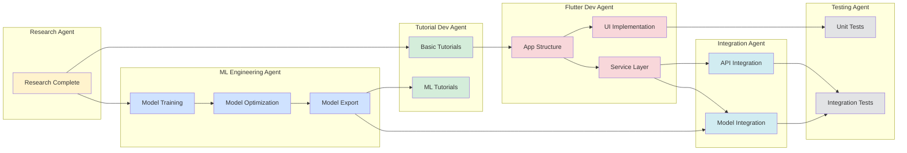

---

## 🎨 Workflow 7: Content Creation Pipeline

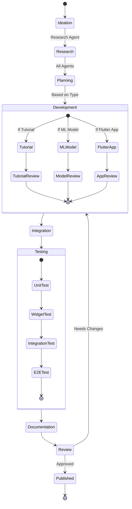

---

## 🔧 Workflow 8: Issue Resolution

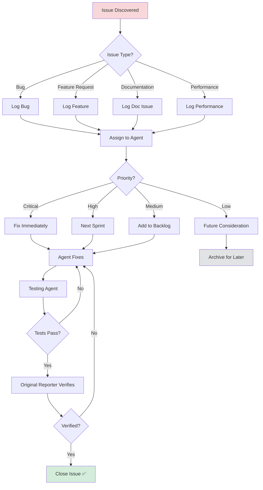

---

## 📈 Progress Tracking Workflow

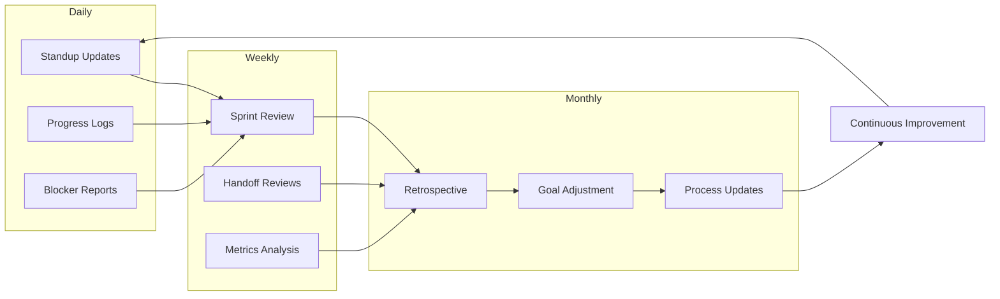

---

## 🎓 Learning Path Workflow

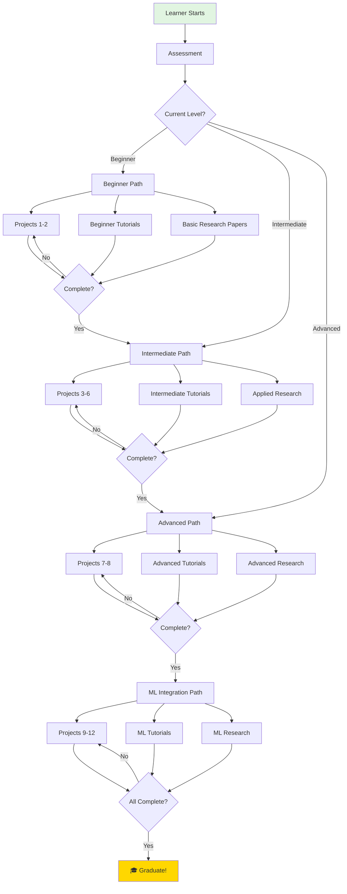

---

## 🔄 Iteration Cycle

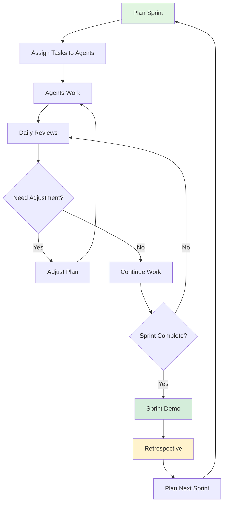

---

## 📊 Success Metrics Dashboard

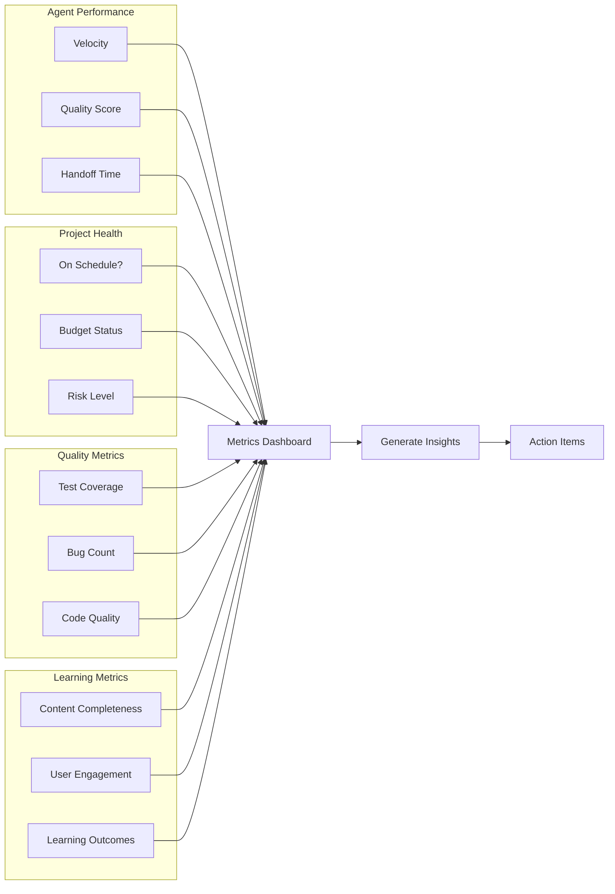

---

## 🎯 Summary

This document provides visual representations of:

1. **Overall Project Flow** - 7-phase development lifecycle
2. **Agent Collaboration** - How agents interact
3. **Specific Workflows** - Detailed process flows for:
   - ML-powered project development
   - Tutorial creation
   - ML model pipeline
   - Quality assurance
   - Continuous integration
   - Dependency management
   - Content creation
   - Issue resolution
   - Progress tracking
   - Learning paths
   - Iteration cycles
   - Success metrics

Each workflow is designed to maximize:
- **Efficiency** - Parallel work when possible
- **Quality** - Multiple review stages
- **Clarity** - Clear handoff procedures
- **Traceability** - Documented decisions
- **Flexibility** - Adaptable to changes

---

**Status:** ✅ Complete
**Next Steps:** Begin implementation with Phase 1 (Research Agent)
